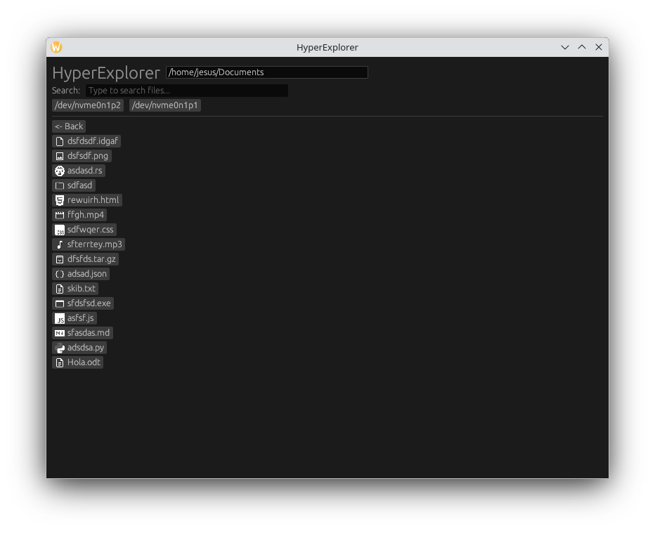

<h1>HyperExplorer</h1>
HyperExplorer is a file explorer built with Rust and egui.  
I started this project because I find Windows File Explorer lacking, and I wanted a faster and more customizable alternative.


## Roadmap
- [x] Basic navigation
- [x] Opening files
- [ ] Context menu
- [ ] Drag and drop
- [ ] File and directory icons
- [ ] Search (filenames and file content)
- [ ] Better UI

## Download
You can download the latest release from the [releases](https://github.com/triplean/hyperexplorer/releases) page.

## Building and running 
You can build the project with <pre>```cargo build```</pre> or build and run it directly with <pre>```cargo run```</pre>

## Contributing
I'd love to see contributions to this project!  
If you want to contribute, you can create an [issue](https://github.com/triplean/hyperexplorer/issues/new/choose) to report bugs or suggest features, or send a [pull request](https://docs.github.com/articles/about-pull-requests) directly.
